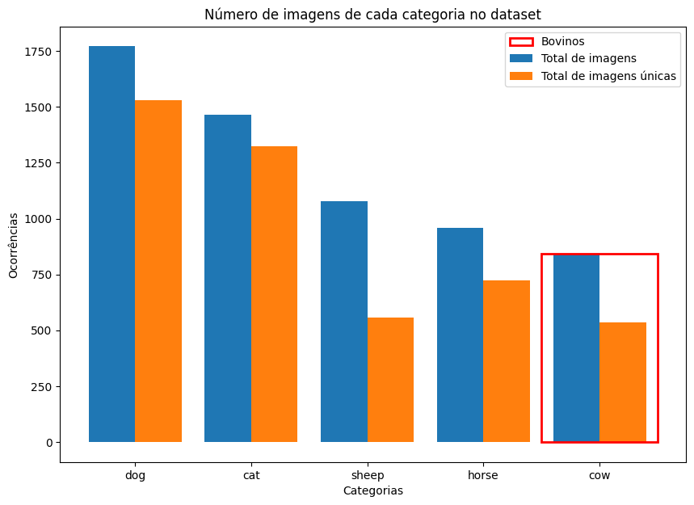
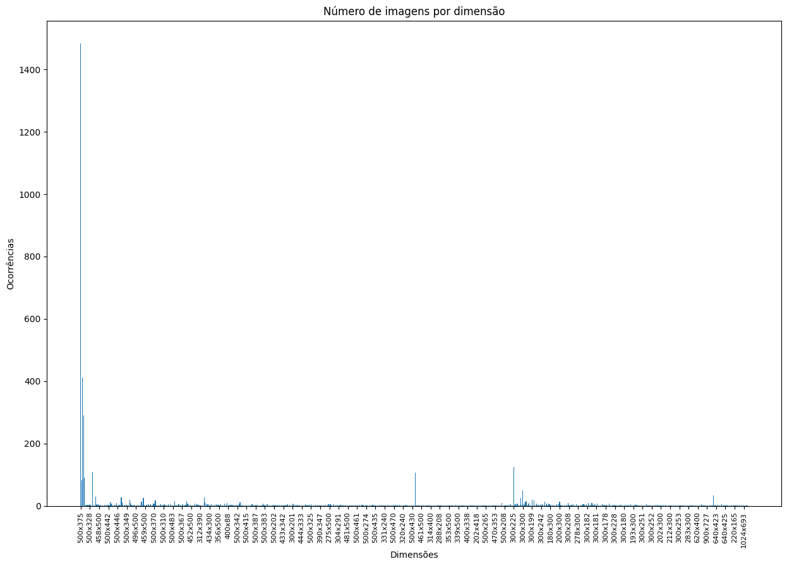
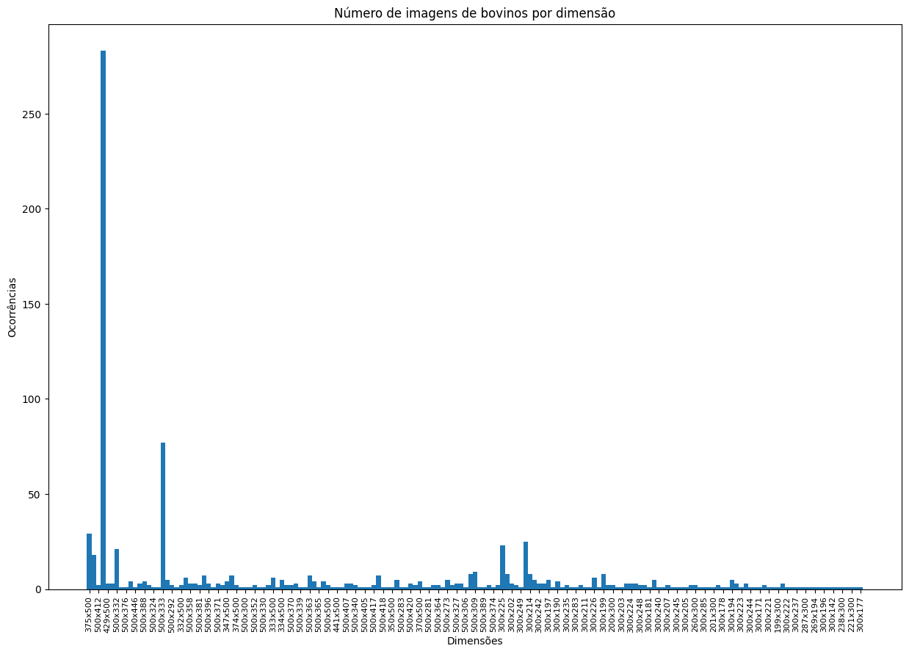
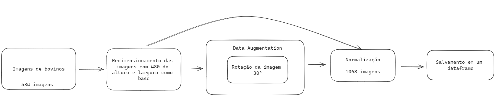
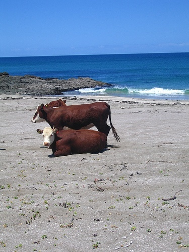
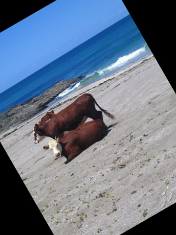
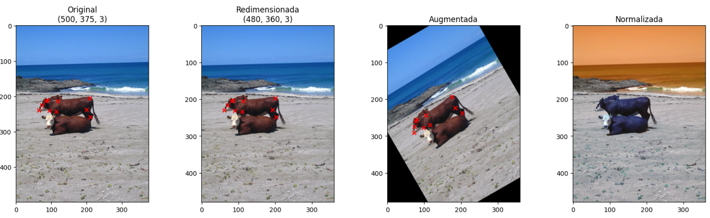
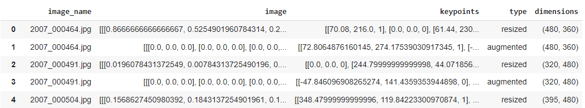
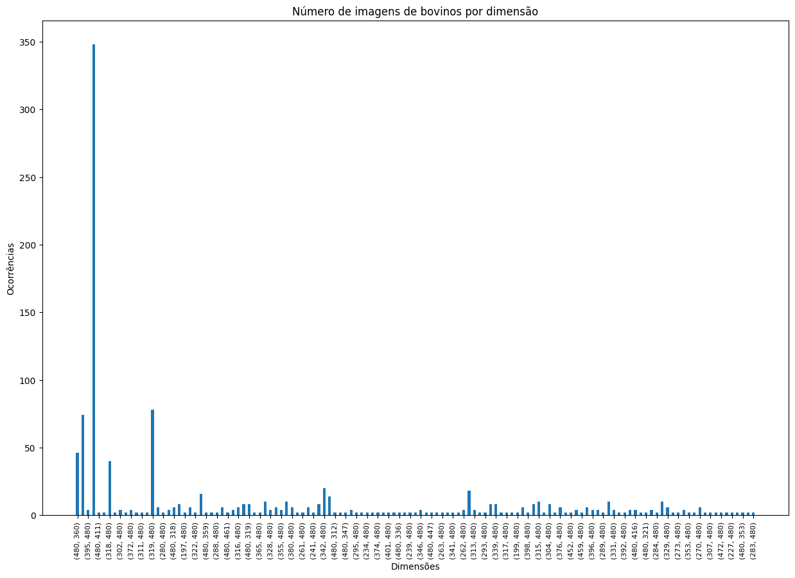
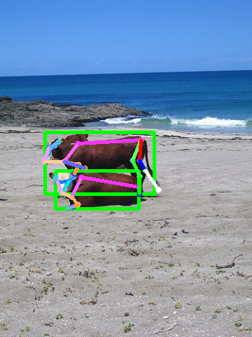

# Atividade: Animal Pose Estimation
Caso queria acessar via colab: https://colab.research.google.com/drive/1MpRfCg3BiPdVESWYgRc8mds9NQGvMk5m?usp=sharing 
## 1. Análise Exploratória
Foi feita uma análise de 2 pontos principais: dimensões das imagens do dataset e quantidade de imagens do dataset.

### 1.1 Análise de quantidade de imagens por categoria
Considerando o foco no pose estimation para bovinos essa etapa é crucial para entender quanto do dataset é de bovinos. A partir das categorias as imagens foram dividas em listas separadas.

O gráfico acima reflete a quantidade de imagens de cada categoria, tanto total quanto únicas (algumas imagens se repetem, mas seus jsons são diferentes). O retângulo vermelho representa os bovinos, no caso, apenas a classe de vacas.

| Categoria                   | Total de Imagens | Total de Imagens Únicas |
|-----------------------------|------------------|-------------------------|
| Todas as Imagens            | 6117             | 4666                    |
| Imagens de Bovinos          | 842              | 534                     |

Assim, temos 842 imagens de bovinos das 6117 totais, sendo 534 únicas.

### 1.2 Análise de dimensões das imagens do dataset
Essa análise é importante para entender se todas as imagens possuem as mesmas dimensões ou não.

O gráfico acima mostra a distribuição das diferentes dimensões do dataset. É possível perceber que há uma grande variedade de dimensões, mesmo que 32.16% das imagens possua dimensão 500x375. Isso traz insights importantes para o processamento, já que dependendo do modelo de treinamento as dimensões deverão ser padronizadas.

O gráfico acima mostra a distribuição das diferentes dimensões do dataset apenas com imagens de bovinos. É possível perceber que há uma grande variedade de dimensões, mesmo que 33.61% das imagens possua dimensão 500x375.

## 2. Filtragem e Processamento
Como dito anteriormente, a filtragem foi feita por meio das categorias, em que nas informações do json dos keypoints cada imagem tem o id da categoria. Com as imagens apenas de bovinos, elas passam por 3 etapas: redimensionamento, rotação e normalização como ilustrado na imagem abaixo.

1. Imagem original 

2. A imagem original e seus pontos-chave são redimensionadas proporcionalmente, mantendo suas proporções originais. Se a altura da imagem é menor que a largura, a nova largura é definida como 480 pixels e a altura é ajustada proporcionalmente; caso contrário, a nova altura é 480 pixels e a largura é ajustada proporcionalmente. 

3. A imagem redimensionada é rotacionada 30º, assim como seus pontos-chave (essa etapa seria pensando em um possível data augmentation para treinamento). 

4. As imagens redimensionadas e rotacionadas são normalizadas para o intervalo 0-1 e salvas em um dataframe.

A imagem abaixo mostra um exemplo detalhado de cada etapa:  

## 3. Resultados do processamento
O dataframe gerado possui 1068 imagens em comparação com as 534 iniciais. A imagem abaixo mostra a estrutura do dataframe:

O gráfico acima mostra a distribuição das diferentes dimensões do dataset apenas com as imagens processadas. É possível perceber que o comportamento é semelhante ao anterior, mas o número de dimensões únicas passou de 169 para 127.

## 4. Conclusões
### Resultado pose estimation
Utilizando o modelo <a href="https://github.com/axinc-ai/ailia-models/tree/master/pose_estimation/animalpose">animalpose</a> foi feita uma predição em uma das imagens do dataset. O resultado foi: 

Este estudo foi muito importante para exercitar todo esse processo de pré treinamento/predição, na preparação dos dados. Pude aprender melhor a como fazer todas essas análises do dataset para entendê-lo melhor, dividir apenas uma parte do dataset para uso e processamento e principalmente utilizar um modelo já pré-treinado apenas para a predição do pose estimation, considerando todo o processo de buscar, encontrar e utilizar. Uma limitação é que não apresenta um método de treinamento, apenas de inferência. Por isso, como sugestão para trabalhos futuros tem-se o uso do dataset para o treinamento de um modelo de pose estimation e também o uso de outras técnicas no processamento.
